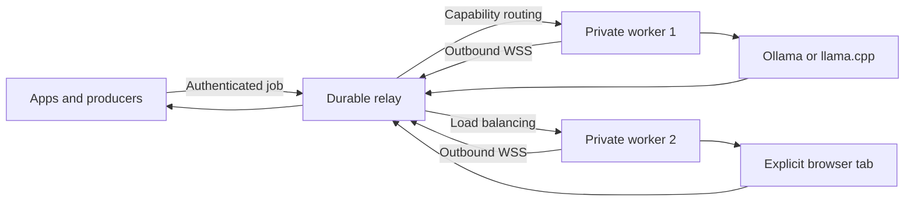

<p align="center">
  
</p>

<h1 align="center">ContextBridge</h1>

<p align="center"><strong>Route AI jobs across your apps, private computers, local models, and explicitly taught browser tabs.</strong></p>

<p align="center">
  <a href="https://github.com/IamAngusU/ContextBridge/releases/latest"></a>
  <a href="LICENSE"></a>
  
  
  
  <a href="https://github.com/IamAngusU/ContextBridge/stargazers"></a>
</p>

ContextBridge is a local-first runtime and decentralized compute router for structured AI jobs. A source can be a folder, website, database worker, command pipeline, private server, or any application that can send JSON. A destination can be one or many private computers running Ollama, a managed `llama.cpp` engine, or an AI page open in a browser tab.

ChatGPT and Gemini are detected automatically from stable DOM and accessibility anchors. For another web chat, choose a tab and visually teach its prompt field, send control, answer area, and optional image upload. Learned overrides stay in extension storage and can be replaced at any time.


## Why ContextBridge

- **Visual browser teaching:** point at page controls instead of reverse engineering selectors.
- **Progressive browser output:** follow a web-chat answer while it is generated, through the worker and relay, with `cluster submit --stream`.
- **Stateful browser conversations:** pin related turns to one browser worker with `session_id`, or use the streaming `cluster chat` terminal.
- **Images and files back:** opt in to bounded response artifacts, verify their SHA-256, and save them with `--artifacts`.
- **1:1, 1:N, and N:N compute:** connect one app to one worker, distribute one queue across many workers, or share a capability-aware node pool between producers.
- **Outbound worker connections:** workers join through WebSockets without router port forwarding or fixed public worker ports.
- **Durable scheduling:** priority queue, history, bounded retries, disconnect recovery, groups, tags, task requirements, and VRAM-aware placement survive relay restarts.
- **Optional E2EE jobs:** a producer can seal a payload for the selected worker with X25519 and AES-256-GCM so the relay cannot read the payload or result.
- **Bounded model pipelines:** chain extraction, embeddings, retrieval, vision, and generation with fixed steps and explicit loop limits.
- **Explicit scope:** only the chosen page origin and local service are requested.
- **Local models:** route text and images to Ollama without adding another hosted service.
- **Managed runtimes:** install an official `llama.cpp` release, verify its SHA256, and supervise it on localhost.
- **Hardware awareness:** inspect RAM, VRAM, CUDA, ROCm, Metal, loaded models, and CPU fallback from CLI or dashboard.
- **Extraction and embeddings:** use validated JSON extraction and native batch vector output through one protocol.
- **RAG foundation:** ingest and search tenant-isolated vectors through a replaceable vector-store interface.
- **Structured output:** model output is normalized before it reaches the calling application.
- **Fail-safe moderation:** invalid, missing, or timed-out decisions become `review`, never silent approval.
- **Flexible inputs:** HTTP, stdin, folders, SSH pipelines, database workers, and custom adapters use one protocol.
- **Inspectable operation:** a local dashboard shows routes, hardware, providers, models, latency, flags, jobs, and decisions.
- **Portable deployment:** one executable for Windows, Linux, and macOS on AMD64 and ARM64.

## Quick Start

### Windows

Open PowerShell and run:

```powershell
irm https://angusu.de/contextbridge/install.ps1 | iex
```

### Linux or macOS

```bash
curl -fsSL https://angusu.de/contextbridge/install.sh | sh
```

The installer verifies the matching published release checksum, creates a private config, asks whether this device is local-only, a relay, a worker, or both, sets up user autostart where supported, starts the service, and opens the dashboard. It can use an existing Ollama installation, install a managed `llama.cpp` runtime, or pair a browser tab.

## Automatic Updates

Verified stable updates are enabled by default. The Go service checks independently of the dashboard, and supported installers also register a daily operating-system update job. A JavaScript or dashboard failure cannot disable the updater.

```bash
contextbridge update status
contextbridge update check
contextbridge update apply
contextbridge update disable
contextbridge update enable
```

An update is downloaded beside the current executable, checked against both `SHA256SUMS` and the GitHub release asset digest, started once to verify its reported version, then activated atomically. The previous executable remains as `.previous` for rollback. Windows uses a short-lived local PowerShell helper after the running process exits; Linux and macOS replace the executable directly and let the managed service restart.

The public installer endpoint counts total requests and privacy-preserving unique installer starts. Unique values use an HMAC of a masked network prefix and short user-agent family. Raw IP addresses, cookies, prompts, results, device names, and model activity are not collected. Self-hosted installations do not send runtime telemetry to `angusu.de`.

Manual installation is just as small:

```bash
contextbridge init
contextbridge run
contextbridge doctor
contextbridge dashboard
```

`contextbridge doctor` verifies the config, running local service, token, default
route, relay, and worker identity. It prints a concrete fix for every blocking
check; use `--json` in installers and monitoring.

## Build A Compute Cluster

The same protocol covers every topology. Workers always connect outward to a TLS relay, report current capabilities and load, and receive only jobs allowed by their token and group policy.

### Relay

```bash
contextbridge cluster configure --mode relay --public-url https://relay.example.com
contextbridge run
contextbridge cluster dashboard
```

Place Caddy, nginx, or another TLS reverse proxy in front of the relay's localhost listener. No worker port needs to be opened in a home router.

Production templates for a hardened systemd service and an nginx path proxy live in [`deploy/`](deploy/). Update the internal port if the installer selected another one.

### Worker

```bash
contextbridge cluster configure --mode worker --relay-url https://relay.example.com
contextbridge pair
contextbridge run
```

The worker prints a short code. An admin approves it in the relay dashboard or with `contextbridge cluster pairing --approve CODE`. The node token and X25519 private key stay in the owner-only identity file.

### Producer

Create a scoped producer token once:

```bash
contextbridge cluster token --role producer --subject support-api
contextbridge cluster submit --file examples/cluster-job.json --token cb_producer_TOKEN
contextbridge cluster submit --file examples/cluster-job.json --token cb_producer_TOKEN --e2ee
contextbridge cluster chat --token cb_producer_TOKEN
```

Set requirements such as `task`, `provider`, `group`, `model`, `vision`, `embedding`, tags, or minimum free VRAM. Use `provider: browser` to require a live, taught web-chat tab, or `provider: ollama` to require a local Ollama engine. The scheduler chooses a compatible online node using live concurrency, queue, RAM, and VRAM data. Measured VRAM demand is a preference, not a hidden requirement, so CPU-only workers remain useful unless `min_free_vram_bytes` is explicitly set. Normal TLS jobs can move to another node after a disconnect. E2EE jobs are bound to the worker key selected during reservation and fail clearly if that worker disappears.

Use the same non-secret `requirements.session_id` for follow-up turns. The relay keeps that producer's conversation on the most recently used compatible worker, while retaining failover when the node is offline. The selected ChatGPT or Gemini tab supplies the actual conversation history. `contextbridge cluster chat` manages the ID automatically and provides a streaming `you ›` / `ai ›` terminal session. A producer token may be passed with `--token`, stored safely from a credential file with `contextbridge cluster login --token-file producer.json`, or supplied through `CONTEXTBRIDGE_CLUSTER_TOKEN`.

This release uses one durable BoltDB file per relay process. It supports many producers and workers through one relay. Active-active relay replication is a separate deployment tier and requires a shared database and message broker rather than copying the BoltDB file.

## Connect A Browser Tab


1. Load `extension/chromium` in Chrome, Edge, Opera, Brave, or Vivaldi. Use `extension/firefox` for Firefox.
2. Open ChatGPT or Gemini and select the tab in the ContextBridge extension. Both are detected automatically.
3. Choose **Test profile**, then **Start browser bridge**.
4. For another provider, choose **Customize detection** and click the requested controls directly in the page.

Add `--stream` to `contextbridge cluster submit` to print progressive browser text while the final normalized result remains on stdout. Plaintext progress is deliberately disabled for E2EE jobs.

Set `output.artifacts: true` on a browser text/JSON job to collect up to four generated images, download links, or code files from the final response. Embedded files are capped by `max_artifact_bytes` (6 MiB maximum), normalized, and SHA-256 verified. Save them with `contextbridge cluster submit --artifacts ./downloads ...`; provider-hosted resources that the page cannot read remain HTTPS references in the JSON result. The interactive `cluster chat` command saves artifacts automatically under the local ContextBridge storage directory unless `--artifacts off` is used. See [`examples/browser-image-job.json`](examples/browser-image-job.json).

Each browser extension instance is one serial UI slot. For parallel browser jobs, pair multiple workers with independently selected tabs (for example separate browser profiles) and let the relay distribute sessions between them. Local Ollama/llama.cpp jobs can use higher worker concurrency and continue to participate without a GPU; GPU headroom only influences placement unless a job explicitly requires VRAM.

The Chromium package works with Manifest V3 browsers. The Firefox package has its own background manifest and localhost policy. Local Firefox development installs use `about:debugging`; a permanent consumer install requires a Mozilla-signed package.

See [Visual browser teaching](docs/browser-teaching.md) for exact browser steps and profile behavior.

## Use Ollama

Install Ollama and start ContextBridge:

```bash
contextbridge run
```

With `model: auto`, ContextBridge selects the smallest compatible local model. Image jobs prefer a vision-capable model and embedding jobs require an embedding-capable model. An explicit model name always wins. The default route tries Ollama first and uses the paired browser only when Ollama is unavailable.

## Use Managed GGUF Models

ContextBridge can install a current official `llama.cpp` binary for the detected platform. The GitHub release digest is verified before the archive is extracted.

```bash
contextbridge runtime install llama.cpp
contextbridge pull jina-v4-retrieval
contextbridge pull nuextract3
```

Set the selected engine to `auto_start: true`. `gpu: prefer` requests full GPU offload and visibly falls back to CPU if startup fails. `gpu: require` reports an error instead. `gpu: off` stays on CPU.

The built-in manifests use [Jina v4 retrieval](https://huggingface.co/jinaai/jina-embeddings-v4-text-retrieval-GGUF) with required mean pooling and [NuExtract3](https://huggingface.co/numind/NuExtract3-GGUF) with its multimodal projector. Model downloads resume from partial files and are checked against Hugging Face LFS SHA256 metadata. Runtime calls follow the official [llama.cpp server API](https://github.com/ggml-org/llama.cpp/blob/master/tools/server/README.md) and [Ollama API](https://github.com/ollama/ollama/blob/main/docs/api.md).

## Send A Job

```bash
contextbridge submit --file examples/job.json
```

Or stream a trusted source through stdin:

```bash
ssh data-host '/opt/export-next-context-job' | contextbridge submit --file -
curl -fsS http://127.0.0.1:9000/next-job | contextbridge submit --file -
```

A folder producer can place the same JSON document in the configured inbox. ContextBridge claims it atomically and writes a neighboring `.result.json` file.

```json
{
  "source": "support-queue",
  "route": "default",
  "kind": "moderation",
  "prompt": "Review this public submission.",
  "text": "Content supplied by the user"
}
```

See the [job protocol](docs/protocol.md) and [integration recipes](docs/integrations.md).

Cluster jobs wrap that local job in routing requirements. See [examples/cluster-job.json](examples/cluster-job.json).

Choose an explicit output contract per job:

| Mode | Result | Typical use |
| --- | --- | --- |
| `decision` | Strict `allow` or `review` object | Moderation and approval gates |
| `json` | Parsed JSON with optional required keys | Extraction, classification, enrichment |
| `text` | Bounded plain text | Summaries, drafts, and transformations |
| `embedding` | Native `[][]float32` with dimensions | Search, clustering, and RAG |
| `rag` | Indexed count or ranked document matches | Tenant-isolated retrieval |

ContextBridge treats every result as data. It never evaluates returned code or runs returned commands.

## Configuration

Generated config locations:

| Platform | Default path |
| --- | --- |
| Windows | `%LOCALAPPDATA%\ContextBridge\config.yml` |
| Linux | `~/.config/contextbridge/config.yml` |
| macOS | `~/.config/contextbridge/config.yml` |

Start from [config.example.yml](config.example.yml). A route declares a primary provider, ordered fallbacks, timeout, and optional browser profile. Visual profiles live in extension storage; YAML profiles remain available for audited and reproducible deployments.

```yaml
routes:
  default:
    provider: ollama
    fallback: [browser]
    timeout_seconds: 180
    browser_profile: ""
  embedding:
    provider: jina
    fallback: [ollama]
    task: embedding

engines:
  jina:
    type: llama_cpp
    model: jina-v4-retrieval
    listen: 127.0.0.1:32147
    auto_start: true
    gpu: prefer
    mode: embedding
    pooling: mean
```

Leave `browser_profile` empty for the profile taught in the extension. Set it to a YAML profile name when the server must require a reviewed selector set.

## Architecture



ContextBridge never executes commands returned by a model. Source credentials stay with the source process. Browser page content is treated as untrusted data and output is reduced to the configured decision vocabulary.

Read [Architecture](docs/architecture.md) and [Security](docs/security.md) before connecting a remote source.

## Repository Layout

| Path | Purpose |
| --- | --- |
| `cmd/contextbridge` | Cross-platform CLI and service entry point |
| `internal/bridge` | Routing, providers, local API, storage, and dashboard |
| `internal/cluster` | Pairing, E2EE, durable queue, scheduler, relay, workers, pipelines, and cluster dashboard |
| `internal/config` | YAML parsing, defaults, and validation |
| `internal/modelregistry` | Verified GGUF model downloads and local registry |
| `internal/systeminfo` | Cross-platform hardware and backend telemetry |
| `internal/vectorstore` | Replaceable RAG storage contract and local backend |
| `extension/src` | Shared browser extension source |
| `extension/chromium` | Ready-to-load Chromium package |
| `extension/firefox` | Ready-to-load Firefox package |
| `scripts` | Reproducible extension and release checks |
| `deploy` | Hardened systemd and nginx relay templates |
| `web` | Public one-file welcome page, cached repository stats, and installer counters |
| `docs` | Protocol, architecture, security, and integrations |

## Development

```bash
go test ./...
go vet ./...
./scripts/package-extensions.sh
./scripts/verify-extensions.sh
```

Releases do not depend on GitHub Actions. From PowerShell, build every supported
platform bundle, both extension archives, and `SHA256SUMS` locally:

```powershell
.\scripts\build-release.ps1 -Version v0.4.0
```

Contributions are welcome. Start with [CONTRIBUTING.md](CONTRIBUTING.md), use a focused issue for behavior changes, and include tests for routing or protocol work.

## Project Status

ContextBridge is usable today for local workflows and single-relay private compute clusters. Browser pages can change their HTML without notice, so visual profiles are testable and automation failures return `review`. Active-active relay HA and signed browser-store distribution remain future deployment tiers.

MIT licensed. Built and maintained by [Angus Uelsmann](https://github.com/IamAngusU).
