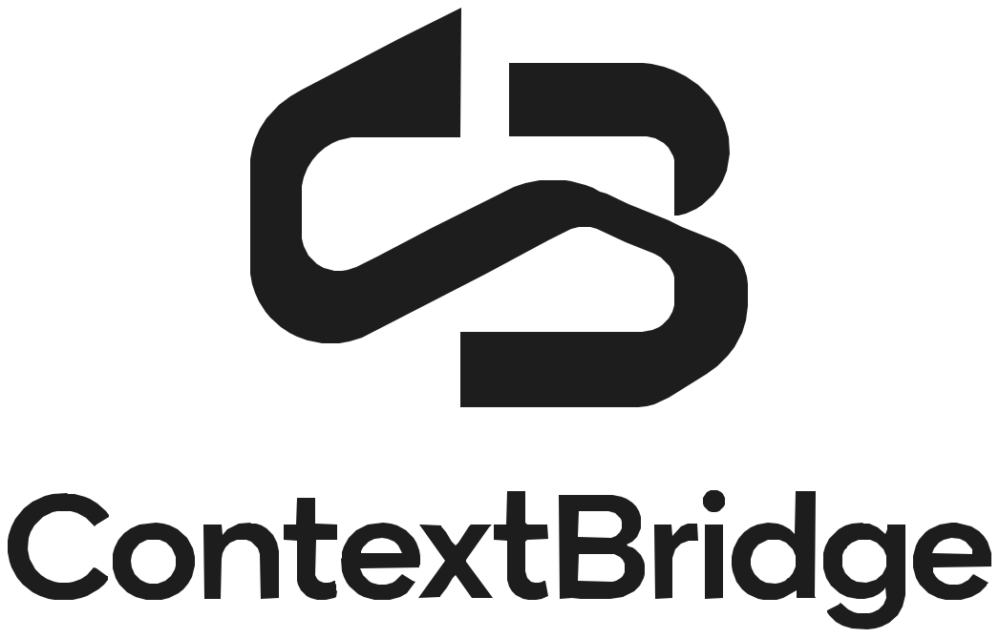
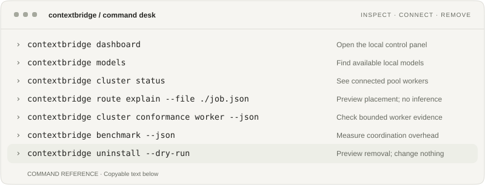

<p align="center">
  <picture>
    <source media="(prefers-color-scheme: dark)" srcset="docs/assets/readme/wordmark-dark.svg">
    
  </picture>
</p>

<h1 align="center">Your AI resources. One connected pool.</h1>

<p align="center">Own the compute. Route the work.<br>Connect local models, private machines and model APIs without replacing them.</p>

<p align="center">
  <a href="https://github.com/IamAngusU/ContextBridge/releases/latest"></a>
  <a href="LICENSING.md"></a>
  <a href="docs/compatibility.md"></a>
  <a href="docs/operations.md"></a>
</p>

<p align="center"><a href="#get-running">Install</a> · <a href="#connect-your-devices">Connect devices</a> · <a href="#just-prompt-the-pool">Prompt the pool</a> · <a href="#send-work-from-your-app">Send a job</a> · <a href="#measured-overhead">Benchmarks</a> · <a href="#uninstall">Uninstall</a> · <a href="docs/README.md">Docs</a></p>

ContextBridge lets an app on your laptop, VPS or shared hosting send AI jobs to a pool of resources you control. It selects a compatible worker, applies configured policies, tracks the job and validates returned artifacts. **Keep your runtimes. Connect your resources.**

| Your setup | What CB adds |
| --- | --- |
| Website on shared hosting, model on your PC | A PHP/HTTPS request reaches your pool; the worker dials out. |
| Several machines, different capabilities | Route by requirements and available capacity, with an explanation. |
| Multiple apps sharing the pool | Separate producer credentials instead of shared admin secrets. |

Connect **Ollama**, managed **llama.cpp**, **OpenAI-compatible model APIs** and optional external adapters. Get durable jobs, configurable cost/egress boundaries, optional E2EE and free [conformance checks](docs/compatibility.md). No ContextBridge cloud account is required for self-hosting.

## Get running

For this first run, have **Ollama running with at least one installed text-generation model**. The installer can also set up a managed runtime for other workloads.

### Windows PowerShell

```powershell
irm https://raw.githubusercontent.com/IamAngusU/ContextBridge/main/install.ps1 | iex
```

### Linux / macOS

```sh
curl -fsSL https://raw.githubusercontent.com/IamAngusU/ContextBridge/main/install.sh | sh
```

Choose **Existing Ollama**, then **4) Relay and worker on this device**. Leave the public HTTPS URL empty for this local demo. The installer downloads the latest release, checks its published checksum, creates a private configuration and pairs the local worker.

Open a **new terminal**. If the installer did not start the service, run `contextbridge run` and leave that terminal open. In another terminal:

```sh
contextbridge doctor
contextbridge cluster chat --provider ollama --model auto --artifacts off --prompt "Reply exactly with CB-OK"
```

Your local relay queues the request, your worker runs a compatible installed model, and the answer returns to the terminal. `auto` selects an available compatible model, not a promised quality tier.

Commands use the installer-created configuration automatically. For a custom installation, append `--config /path/to/config.yml`. Read [install.ps1](install.ps1) / [install.sh](install.sh) before executing them, or use the [release archives](https://github.com/IamAngusU/ContextBridge/releases/latest).

> [!TIP]
> Trying CB does not lock you in. `contextbridge uninstall --dry-run` previews removal without stopping or deleting anything. [Uninstall keeps your configuration and data by default.](#uninstall)

## Connect your devices

A **relay** coordinates the pool. A **worker** runs the job. An **application token** lets another client submit work. Workers connect outbound; they need no public inbound ports.

<details>
<summary><strong>Set up a relay, pair another machine and issue an app token</strong></summary>

### 1. Choose the coordination host

Install CB on your server. Replace `https://relay.example.net` below with your relay's real HTTPS address. Set up an HTTPS reverse proxy with WebSocket support to `127.0.0.1:32150`; the commands below do not create DNS, certificates or the proxy.

Stop an existing managed instance before changing roles (`contextbridge stop`; use its service manager if applicable), then configure and start the relay:

```sh
contextbridge cluster configure --mode relay --listen 127.0.0.1:32150 --public-url https://relay.example.net
contextbridge run
```

Keep the local service on loopback. Only expose the relay through HTTPS. A coordination-only host needs no model or GPU. [Deployment and operations](docs/operations.md).

### 2. Join each compute device

Install CB on the device with your models. If it is already running, stop it before changing roles. Then:

```sh
contextbridge cluster configure --mode worker --relay-url https://relay.example.net --name home-pc
contextbridge pair
```

Pairing prints a code and waits. In a **second terminal on the relay host**, inspect pending requests and approve the matching code:

```sh
contextbridge cluster pairing
contextbridge cluster pairing --approve PAIRING-CODE
```

Replace `PAIRING-CODE` with the code shown on that device. After approval, run `contextbridge run` on the worker. Its identity is saved locally; you do not copy the relay admin token to it. Repeat with a distinct name for each device.

On the relay host, check the pool and send a job:

```sh
contextbridge cluster status
contextbridge cluster chat --provider ollama --model auto --artifacts off --prompt "Which tasks can you help with?"
```

### 3. Give an application its own token

On the running relay host, using its private configuration:

```sh
contextbridge cluster token --role producer --subject my-app
```

This prints token JSON. Store it securely; **never give an application the relay admin token**. For a separate CLI client, save the returned JSON as a private **UTF-8** file named `producer-token.json` and transfer it through a secure channel. Do not commit it.

On that client, install CB in **local** mode, then point it at the relay and load the credential:

```sh
contextbridge cluster configure --mode local --relay-url https://relay.example.net
contextbridge cluster login --token-file ./producer-token.json
contextbridge cluster chat --provider ollama --model auto --artifacts off --prompt "Reply exactly with POOL-OK"
```

The client submits work without joining as a worker. Login stores the token in its private config; remove the temporary token file when no longer needed. Use `--role observer` when issuing a read-only monitoring credential.

For your own app, use the producer token with the [native job API or PHP client](docs/integrations.md). The local OpenAI-compatible API uses the **local service token**, not the relay producer token. [Pool and placement details](docs/pools-and-placement.md).

</details>


## Just prompt the pool

Once a client has a producer credential, you do not need to build a job file just to use the pool:

```sh
contextbridge cluster chat --provider ollama --model auto --artifacts off --prompt "Summarize this in three bullets: ..."
```

The answer comes back to the same terminal. For the shortest round-trip check:

```console
$ contextbridge cluster chat --provider ollama --model auto --artifacts off --prompt "Reply exactly with CB-OK"
  → angefragt: ollama · Modell auto
ai  › CB-OK
  ↳ verwendet: ollama · qwen2.5:latest
  ✓ 1.8s · <worker-id>
```

The `ai ›` line is the model answer. ContextBridge then shows execution metadata so you can see what actually handled the job. The selected model, worker ID and timing depend on your pool.

Attach one local image when the selected worker/model supports vision:

```sh
contextbridge cluster chat --provider ollama --model auto --attach-image ./photo.jpg --artifacts off --prompt "Describe what is visible. Do not guess unreadable text."
```

`--attach-image` accepts one PNG, JPEG, WebP, or GIF up to 8 MiB decoded. The job carries a vision requirement, so a worker that cannot satisfy it is not eligible.

You can also put hard requirements on the request. For example, if your relay policy classifies Ollama as local and your workers advertise a `private` group:

```sh
contextbridge cluster chat --provider ollama --group private --egress local_only --e2ee --artifacts off --prompt "Summarize this private note: ..."
```

`--group private` restricts placement to workers in that group. `--e2ee` encrypts prompt and result payloads between the producer and the reserved worker; the relay still sees coordination metadata. `--egress local_only` is an enforced boundary only when execution policy is enabled and the provider is correctly classified. Worker owners can separately restrict allowed tasks, providers, models, and concurrency. For supported remote providers, `--max-cost-usd` can request a hard cost ceiling; unverifiable pricing fails closed when that ceiling is required.

<details>
<summary><strong>What can I attach today?</strong></summary>

| Input | Current native path |
| --- | --- |
| Text prompt | `cluster chat --prompt "..."` |
| One image | `--attach-image FILE` for PNG/JPEG/WebP/GIF, max 8 MiB decoded |
| Multiple images in one job | Not currently a native `cluster chat` input |
| UTF-8 text file | Read the authorized file in your app and send its contents as `payload.text` |
| PDF / DOCX / spreadsheet | Extract the text or selected pages first, or use a separate integration |
| ZIP / arbitrary files | No generic native file-upload field today; CB does not unpack or execute a ZIP because its path was mentioned in a prompt |
| Returned files | Capable adapters can return verified artifacts; up to 12 share the aggregate 12 MiB decoded budget |

A path or URL inside prompt text does not give ContextBridge permission to read or fetch it. See the [pool input and control examples](examples/pool/README.md) for text/JSON jobs, application uploads, policy setup, and artifact handling.

</details>

## Send work from your app

**Shared hosting works too:** your server-side PHP application posts a job to the relay and retrieves the result later. The [PHP client](examples/php/ContextBridgeClient.php) needs PHP 8.1+, cURL and outbound HTTPS, not a CB process, shell access or a GPU on the web host. The relay and workers run elsewhere.

This is a real pool request. Save it as `job.json` ([example file](examples/pool/text-job.json)):

```json
{
  "contract_version": "contextbridge.job.v1",
  "source": "my-web-app",
  "requirements": { "task": "generation", "provider": "ollama" },
  "payload": {
    "provider": "ollama",
    "prompt": "Summarize the supplied text in two sentences.",
    "text": "Delivery moved to Friday. Notify support.",
    "output": { "mode": "text", "max_bytes": 4096 }
  },
  "max_attempts": 1
}
```

From a configured CLI client, preview admission and then submit:

```sh
contextbridge cluster contract validate --file ./job.json --json
contextbridge cluster submit --file ./job.json
```

### Get the answer back

Application code does not parse terminal output. The durable flow is:

```text
submit -> job ID -> worker runs -> completed -> result.output.text
```

For a completed text job, the relevant part of the JSON result looks like this:

```json
{
  "status": "completed",
  "result": {
    "output": {
      "mode": "text",
      "text": "Delivery moved to Friday. Notify support."
    }
  }
}
```

So in any language that can send and read JSON, the answer is simply `result.output.text`. The native relay API accepts the job at `POST /v1/cluster/jobs?compact=1`; fetch it later with `GET /v1/cluster/jobs/JOB_ID?compact=1`.

The included PHP client makes the same flow small. For a CLI script, worker, or other process where waiting is acceptable:

```php
<?php

require __DIR__ . '/ContextBridgeClient.php';

$relay = getenv('CONTEXTBRIDGE_RELAY_URL') ?: '';
$token = getenv('CONTEXTBRIDGE_PRODUCER_TOKEN') ?: '';
$client = new \ContextBridge\ContextBridgeClient($relay, $token);

$request = json_decode(
    file_get_contents(__DIR__ . '/job.json'),
    true,
    64,
    JSON_THROW_ON_ERROR,
);

// Use one stable, persisted idempotency key for one logical operation.
$accepted = $client->submit($request, 'order-123-summary');
$job = $client->wait($accepted['id']);

echo $job['result']['output']['text'] ?? '';
```

For a normal web request, do not keep PHP open waiting for the model. Persist the returned job ID, then read it in a later authenticated request or cron/worker:

```php
$accepted = $client->submit($request, $operationId);
$jobId = $accepted['id']; // persist this

// Later:
$job = $client->job($jobId);
if (($job['status'] ?? '') === 'completed') {
    $answer = $job['result']['output']['text'] ?? null;
}
```

Handle `failed` and `cancelled` separately. Text output can also report `truncated: true` when it reaches the requested byte limit. See the [complete PHP example](examples/pool/README.md#3-submit-from-php-shared-hosting) for production-oriented error handling, polling and idempotency.

**Your job, your constraints:** choose a provider/model, worker group, JSON keys or output size. Egress and cost limits require enabled operator policy and supported enforcement; a prompt cannot grant extra permissions. Text files can supply text, one supported image can be attached, and capable adapters can return files. There is no generic `files[]` upload field.

[PHP submission, polling, text/JSON examples and file boundaries](examples/pool/README.md) · [Operator and per-job controls](examples/pool/README.md#4-choose-what-a-job-may-use-and-return). The PHP example uses HTTPS, not E2EE; keep producer tokens server-side.

## Measured overhead

**Coordination, not inference.** Dated development measurements from **20 September 2026**, with 128 samples after 8 warmups and one concurrent client:

| Operation | Windows p50 / p99 | Linux VPS p50 / p99 |
| --- | ---: | ---: |
| Durable submit → read → cancel | 2.402 / 3.740 ms | 12.165 / 36.304 ms |
| Small E2EE job + result | 0.098 / 0.193 ms | 0.217 / 0.496 ms |
| Verify a 64 KiB artifact | 0.065 / 0.134 ms | 0.141 / 0.446 ms |

Queue throughput: **418.5 ops/s** on the Windows i9-12900K; **73.8 ops/s** on the shared two-vCPU Linux VPS. Sampled idle benchmark-process + relay RSS: **14.4 / 12.7 MiB**, respectively. No models were running in these measurements.

These are different machines, not an OS comparison or an SLA. Model execution and cross-device network latency are excluded; shared-VPS contention was uncontrolled. [Exact commits, methodology, p95, concurrency 1/4/16/64 and limits](docs/limits-and-performance.md). Reproduce on your hardware with `contextbridge benchmark --json`.

## Command desk

<p align="center">
  <picture>
    <source media="(max-width: 600px)" srcset="docs/assets/readme/command-desk-mobile.svg">
    
  </picture>
</p>

<details>
<summary><strong>Copy commands and explore automation</strong></summary>

```sh
contextbridge dashboard
contextbridge models
contextbridge cluster status
contextbridge route explain --file ./job.json
contextbridge cluster conformance worker --json
contextbridge benchmark --json
contextbridge uninstall --dry-run
```

For `route explain`, use a native cluster job such as [examples/cluster-job.json](examples/cluster-job.json). Pool commands require a configured, running relay and an authorized credential. Route previews and conformance checks do not send inference requests; uninstall dry-run does not stop or remove anything.

| Want to… | Command / guide |
| --- | --- |
| Connect an MCP client | `contextbridge mcp serve` · [Integrations](docs/integrations.md) |
| Inspect schedules | `contextbridge schedule list` · [Automation](docs/automation.md) |
| Read a completed job's receipt | `contextbridge cluster receipt show JOB_ID` |
| Plan bounded multi-step work | [Agents and approval boundaries](docs/bounded-agent.md) |
| Check for an update without installing it | `contextbridge update check` |

</details>

## Uninstall

**Preview first. Nothing is stopped or removed:**

```sh
contextbridge uninstall --dry-run
```

Then remove the installer-owned program and integrations, keeping configuration and managed data:

```sh
contextbridge uninstall
```

Acts on **this machine only**, not the whole pool. Active work blocks removal unless explicitly overridden. To deliberately remove locally managed data as well, review [the separate `--purge` option and preserved paths](docs/operations.md#remove-contextbridge-safely). No purge or force flag is needed for an ordinary uninstall.

## Open by design. Precise about trust.

Self-hosting is fully functional. CB coordinates existing runtimes; it does not pool VRAM or split a model itself. Optional E2EE protects job payloads, **not coordination metadata**. Configurable policies are not all enabled by default. Ambiguous execution is not silently retried.

Releases include checksums, SBOMs and third-party notices; AGPL releases also publish corresponding source. Build records are explicitly unsigned. Free conformance is separate from the future **ContextBridge Verified** program. [Security](docs/security.md) · [Supply chain](docs/supply-chain.md) · [Verification](docs/verification.md).

**License:** current core **AGPL-3.0-only**; explicitly listed schemas, examples and interface documents **Apache-2.0**; published **v0.6.0–v0.6.3 remain MIT**. [Exact boundaries](LICENSING.md) · [Project identity](TRADEMARKS.md).

**Early-stage, pre-1.0 software.** Reviews, reproducible bug reports and integration feedback are welcome. External core-code PRs are paused pending the contributor agreement. [Contributing](CONTRIBUTING.md) · [Report a vulnerability privately](SECURITY.md) · [All documentation](docs/README.md).
