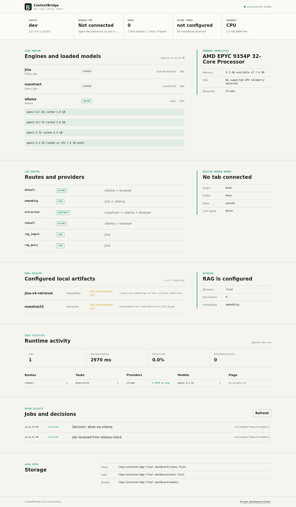
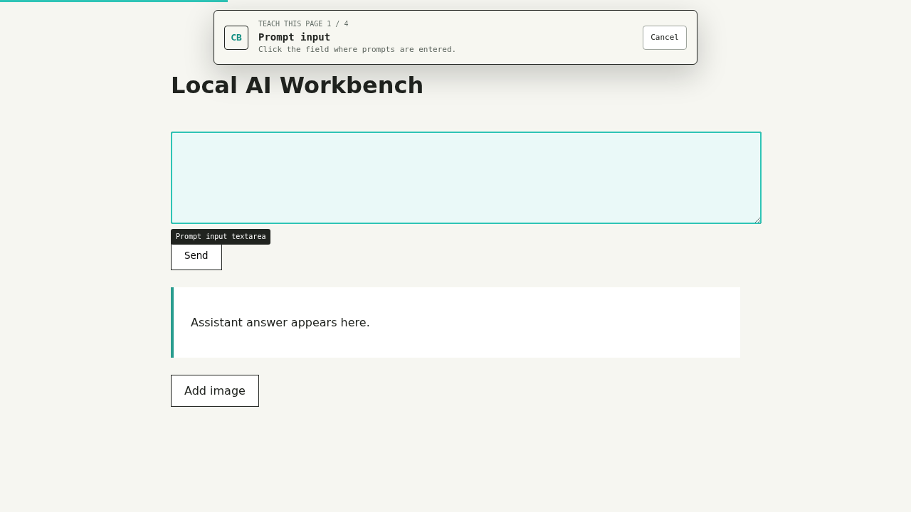
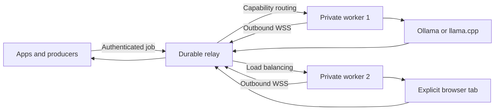

<p align="center">
  
</p>

<h1 align="center">ContextBridge</h1>

<p align="center"><strong>Route AI jobs across your apps, private computers, local models, and explicitly taught browser tabs.</strong></p>

<p align="center"><a href="docs/start-here.de.md">🇩🇪 Deutsch: ContextBridge einfach verstehen, installieren und ausprobieren</a></p>

<p align="center">
  <a href="docs/demo-video-de-en.md">🎬 3-minute demo script · DE/EN narration</a>
  ·
  <a href="docs/demo-de-en.md">Copy-paste technical demo runbook</a>
</p>

<p align="center">
  <a href="https://github.com/IamAngusU/ContextBridge/releases/latest"></a>
  <a href="LICENSE"></a>
  
  
  
  <a href="https://github.com/IamAngusU/ContextBridge/stargazers"></a>
</p>

ContextBridge is a local-first runtime and decentralized compute router for structured AI jobs. A source can be a folder, website, database worker, command pipeline, private server, or any application that can send JSON. A destination can be one or many private computers running Ollama, a managed `llama.cpp` engine, or an AI page open in a browser tab.

ChatGPT and Gemini are detected automatically from stable DOM and accessibility anchors. For another web chat, choose a tab and visually teach its prompt field, send control, answer area, and optional image upload. Learned overrides stay in extension storage and can be replaced at any time.



## Why ContextBridge

- **Visual browser teaching:** point at page controls instead of reverse engineering selectors.
- **Progressive browser output:** follow a web-chat answer while it is generated, through the worker and relay, with `cluster submit --stream`.
- **Stateful browser conversations:** pin related turns to the conversation that actually executed them with `session_id`, even after that saved chat moves to another attached tab on the same worker. Routing uses redacted opaque evidence; exact URL proof stays in the extension.
- **Parallel web-chat pool:** select several ChatGPT and Gemini tabs in one extension; each becomes an independent serial UI slot. Profile and explicit-model requirements must be proven by the same ready waiting tab or exact matching owned session rather than combined across a node. Browser sessions are bound to separate conversations, including when two producers choose the same public `session_id`. A missing ID uses one producer-scoped default session.
- **Provider-aware recovery:** progress percentages, stop/send controls, rate limits, errors, accidental reloads, and stalled image generation are separate states rather than answer text. A one-shot reload requires proof that the same ContextBridge turn is still present and no unsent draft or attachment would be lost.
- **Images and files back:** opt in to bounded response artifacts, verify their SHA-256, and save them with `--artifacts`.
- **Verified artifact handoff:** a scheduled image result can feed the next browser, Ollama, or llama.cpp step without trusting a URL or a model's claim that a file exists.
- **1:1, N:1, 1:N, and N:N compute:** connect one app to one worker, let scoped producers share a worker, distribute one queue across many workers, or share a capability-aware node pool between producers.
- **Outbound worker connections:** workers join through WebSockets without router port forwarding or fixed public worker ports.
- **Durable scheduling:** priority queue, bounded history, fail-closed recovery from ambiguous worker loss, groups, tags, task requirements, and VRAM-aware placement survive relay restarts.
- **Retry-safe admission:** a producer-scoped idempotency key returns the same durable job after a lost HTTP reply and rejects changed content, without pretending ambiguous provider execution is universally exactly-once.
- **Explainable placement:** preview a route without submitting work, or inspect the bounded decision persisted with an assigned job, including stable rejection reasons and additive score components.
- **Optional E2EE jobs:** a producer can seal a payload for the selected worker with X25519 and AES-256-GCM so the relay cannot read the payload or result.
- **Bounded model pipelines:** chain extraction, embeddings, retrieval, vision, and generation with fixed steps and explicit loop limits.
- **Explicit scope:** only the chosen page origin and local service are requested.
- **Local models:** route text and images to Ollama without adding another hosted service.
- **Hot-plug resource packs:** recognize an optional local model kit or toolbox by a stable manifest ID rather than a changing drive letter, without recursively scanning it or executing inserted media; sealed/checksummed trees can use a volume-root sidecar and remain untouched ([portable-pack contract](docs/portable-resource-packs.md)).
- **OpenAI-compatible boundary:** let ordinary clients call route-backed `models` and `chat/completions`, or route explicitly to a reviewed compatible provider, with mandatory local authentication and fail-closed remote egress ([surface and limits](docs/openai-compatible-api.md)).
- **Managed runtimes:** install an official `llama.cpp` release, verify its SHA256, and supervise it on localhost.
- **Hardware awareness:** inspect RAM, VRAM, CUDA, ROCm, Metal, loaded models, and CPU fallback from CLI or dashboard.
- **Extraction and embeddings:** use validated JSON extraction and native batch vector output through one protocol.
- **RAG foundation:** ingest and search tenant-isolated vectors through a replaceable vector-store interface.
- **Structured output:** model output is normalized before it reaches the calling application.
- **Fail-safe moderation:** invalid, missing, or timed-out decisions become `review`, never silent approval.
- **Flexible inputs:** HTTP, stdin, folders, SSH pipelines, database workers, and custom adapters use one protocol.
- **Bounded MCP tools:** a local stdio server exposes status, one-shot job submission, and stored-result lookup without arbitrary shell access or silent retries ([MCP guide](docs/mcp.md)).
- **Inspectable operation:** a local dashboard shows routes, hardware, providers, models, latency, flags, jobs, and decisions.
- **Durable local schedules:** a resource-aware due queue runs one-time and recurring jobs with explicit route/model/reasoning choices, safe restart semantics, pause/resume, bounded history, and sequential follow-ups using prior answers or verified artifacts ([schedules guide](docs/schedules.md)).
- **Portable deployment:** one executable for Windows, Linux, and macOS on AMD64 and ARM64.

### Measured bridge overhead

The provider still determines AI latency; ContextBridge does not hide that
time inside a flattering benchmark. Running the built-in benchmark from the
actual v0.5.70 release binaries on the dated Windows workstation / Linux VPS
test pair produced these single-concurrency p50 observations:

| Operation | Windows | Linux VPS |
| --- | ---: | ---: |
| Authenticated durable submit + compact read + cancel | 2.129 ms | 5.738 ms |
| Small E2EE job + result cryptographic round trip | 0.103 ms | 0.227 ms |
| Decode, validate, and SHA-256-check a 64 KiB artifact | 0.067 ms | 0.116 ms |

These are reproducible engineering observations, not an SLA and not model
inference time. The queue benchmark uses loopback HTTP to a relay hosted in
the same benchmark process; it does not measure Windows-to-VPS network latency.
The exact binaries, method, p50/p95/p99 and throughput at
concurrency 1/4/16/64, resource footprint, older large-payload measurements,
commands, and limitations are in
[Limits and measured ContextBridge overhead](docs/limits-and-performance.md).
Measure the same bridge-only paths and resource footprint on your own machine
with `contextbridge benchmark` (or `contextbridge benchmark --json`).

## Quick Start

### Windows

Open PowerShell and run:

```powershell
irm https://angusu.de/contextbridge/install.ps1 | iex
```

### Linux or macOS

```bash
curl -fsSL https://angusu.de/contextbridge/install.sh | sh
```

The installer verifies the matching published release checksum, creates a private config, asks whether this device is local-only, a relay, a worker, or both, sets up user autostart where supported, starts the service, and opens the dashboard. It can use an existing Ollama installation, install a managed `llama.cpp` runtime, or pair a browser tab.

On Windows, the installer also creates **ContextBridge → Terminal** and **ContextBridge → Dashboard** shortcuts in the user's Start menu. Terminal attaches read-only to the already running service; closing that window does not stop the service or interrupt jobs. Developers can use `contextbridge console` for the same live view, `contextbridge status` for a one-time snapshot, and `contextbridge doctor` for actionable setup checks. `contextbridge run` is only for starting the service itself; do not launch a second copy merely to see its terminal output.

The installer adds its installation folder to the **user PATH** unless `-NoPath` was selected. Open a new CMD or PowerShell window, then run `contextbridge console` to attach to the managed service. The shorter `cb console` is installed as a path-stable alias to the same executable. ContextBridge refuses to replace an existing unrelated `cb` command or file. PowerShell, bash, and zsh completion is installed for new shells by default; opt out with `-NoCompletion` on Windows or `CONTEXTBRIDGE_NO_COMPLETION=1` on Linux/macOS. The auditable scripts are also available through `contextbridge completion powershell|bash|zsh`.

Type `help` inside the live console for a multi-line command list. Type `exit` and press Enter (or use Ctrl+C) to leave that read-only view; the service keeps running. If the view was launched from the Start menu shortcut, its own console window closes too. If you launched it from an existing CMD or PowerShell, you return to that shell and can type `exit` there to close the shell window. `contextbridge stop` asks the standard local `serve`/`run` process to shut down through an authenticated, loopback-only control endpoint; it refuses while local, relay, or worker work is active. `contextbridge stop --force` is the explicit interruption override. A standalone `relay` or `worker` process has no local bridge control endpoint and still uses its service manager or Ctrl+C. Do not close a terminal running `contextbridge run` in the foreground unless you intend to stop that service process.

Browser Connect confirms the local service and selected tabs first. Page-control and model scans continue independently, so one idle or suspended AI page does not hold the Connect button indefinitely; that tab still has to become responsive before a job can send to it. Already loaded text chats often keep working in a background or minimized Chromium window, but browsers may throttle, discard, or lazily render inactive pages. ContextBridge therefore does not claim universal headless browser operation, and it never treats composer readiness alone as proof of completion. One dogfood run retained authenticated liveness after an operator-observed overnight minimized interval and could later foreground an attached tab, but the interval was not continuously instrumented; the [bounded evidence and its limits](docs/known-browser-edge-cases.md#observed-configuration-specific-evidence) are recorded separately.
The popup's **Reconnect automatically after an update or connection loss** option is on by default. It restores the user's existing attached-tab connection after a browser or extension restart and retries temporary service outages with bounded backoff; it never attaches new personal chats or reloads a provider page. **Disconnect** always stays disconnected until clicked again. A rejected pairing token or access permission fails closed and needs a manual fix.

## Automatic Updates

Automatic updates are **off by default**. Opt in from the local dashboard, the browser extension's Connection section, `contextbridge update enable`, or `updates.enabled: true` in config. Supported installers may register an operating-system update job, but while disabled it performs no release check or installation. Once enabled, the Go service checks independently of the UI at the configured interval (24 hours by default); installation waits until the local bridge, worker, and relay have no active jobs. An explicit `updates.enabled: false` is an administrator lock that the UI cannot override. The starter config uses `enabled: null`, which starts off but permits the local toggle. A JavaScript or dashboard failure cannot turn updates on.

On Windows, the running core checks for releases, but only the installer-created **ContextBridge Update** task installs them while the managed ContextBridge task is running. A manually opened terminal or portable copy is never killed or replaced behind the user's back; its update stays available until the terminal is closed and a manual `contextbridge update apply` is run. This avoids quarantining a healthy release just because an `.exe` was still open.

```bash
contextbridge update status
contextbridge update check
contextbridge update apply
contextbridge update disable
contextbridge update enable
```

An update is downloaded beside the current executable, checked against both `SHA256SUMS` and GitHub asset digests, and started to verify its reported version and compatibility with the current config. The previous executable remains available for rollback. Windows uses a short-lived local PowerShell helper after the running process exits; it verifies the restarted service's versioned health response and restores the previous binary if that fails. Linux and macOS keep a pending rollback until the updated service reports healthy. A failed version is not retried automatically; a newer release or an explicit `update apply` can be tried. Unpacked browser extensions still need their files refreshed with the installer and then reloaded in the browser; the core updater does not silently replace a live extension.

If you started `contextbridge run` manually in a Windows terminal, close that terminal with Ctrl+C before calling `contextbridge update apply` from another terminal, then start `contextbridge run` again. Windows cannot replace its still-running executable. The in-process opt-in automatic updater can hand off its own restart; an external manual apply never force-kills your terminal. A blocked manual attempt keeps the old version running and reports the required action.

For a systemd relay whose executable is root-owned but service runs as `contextbridge`, install [`deploy/contextbridge-relay.service`](deploy/contextbridge-relay.service), [`deploy/contextbridge-relay-update.service`](deploy/contextbridge-relay-update.service), and [`deploy/contextbridge-relay-update.timer`](deploy/contextbridge-relay-update.timer). Enable the relay service and update timer. The service uses `CONTEXTBRIDGE_UPDATES_EXTERNAL=1`, so only the root-owned timer performs installations; `updates.enabled: false` still disables them. Each hourly timer run checks whether a release check is due and applies a newer release only when the relay has no queued or active jobs, then restarts and verifies the service with rollback if needed. No GitHub Actions are involved.

The public installer endpoint keeps a bounded aggregate of accepted installer requests and a coarse current-day network estimate. The estimate uses a daily rotating HMAC of a masked network prefix; User-Agent is deliberately excluded. Per-network daily admission, per-day cardinality, and a 31-day uniqueness window bound abuse and retained rows. Raw IP addresses, cookies, prompts, results, device names, and model activity are not collected. Self-hosted installations do not send runtime telemetry to `angusu.de`.

For a portable manual installation, initialize once:

```bash
contextbridge init
```

Then start the service in one terminal and leave that foreground process running:

```bash
contextbridge run
```

Use a **second** terminal for checks and the dashboard, because `run` does not
return to the shell until the service stops:

```bash
contextbridge doctor
contextbridge dashboard
```

For one operator-safe pool check from either a worker PC or VPS, use
`cb selftest` (`contextbridge cluster selftest` is the identical long form). It waits for the requested local engine,
attached ChatGPT/Gemini tabs, and free slots, but sends no AI request by
default. Add `--run` to opt into isolated exact-marker text jobs; add `--image`
only when one real ChatGPT image request is intended. See the
[copy-paste self-test guide](docs/selftest.md).

`contextbridge doctor` verifies the config, running local service, token, default
route, relay, and worker identity. It prints a concrete fix for every blocking
check; use `--json` in installers and monitoring.

## Platform Support And Evidence

Windows and Linux are first-class runtime targets, not browser-only controller
machines. Published releases contain native AMD64 and ARM64 executables; Linux
has the shell installer, user-systemd setup, and hardened systemd/nginx relay
templates. The repository CI workflow targets Ubuntu, Windows, and macOS, with
the race detector on Linux. Release 0.5.70 was additionally exercised on a real
Windows worker and Linux VPS. The VPS relay and producer workflow documented
here is a normal Linux deployment.

macOS has native AMD64/ARM64 release builds, the same shell installer, a
LaunchAgent, and Apple Metal discovery. Its final 0.5.70 validation evidence is
cross-compilation only, not execution on a Mac; this project does not
yet claim a maintained physical-Mac end-to-end matrix for Metal offload,
Ollama, and every browser lifecycle edge case. Use Chromium or Firefox on
macOS—the extension does not claim Safari support. OS support also does not
imply that every GPU telemetry backend or third-party browser UI is available
on every machine.

## Build A Compute Cluster

The same protocol covers every topology. Workers always connect outward to a TLS relay, report current capabilities and load, and receive only jobs allowed by their token and group policy.

### Relay

```bash
contextbridge cluster configure --mode relay --public-url https://relay.example.com
contextbridge run
contextbridge cluster dashboard
```

Place Caddy, nginx, or another TLS reverse proxy in front of the relay's localhost listener. No worker port needs to be opened in a home router.

Production templates for a hardened systemd service and an nginx path proxy live in [`deploy/`](deploy/). Update the internal port if the installer selected another one.

### Worker

```bash
contextbridge cluster configure --mode worker --relay-url https://relay.example.com
contextbridge pair
contextbridge run
```

The worker prints a short code. An admin approves it in the relay dashboard or with `contextbridge cluster pairing --approve CODE`. The node token and X25519 private key stay in the owner-only identity file.

For an unattended Linux or macOS worker, set every installer choice through
environment variables and keep relay approval separate. See the
[headless worker install guide](docs/headless-worker-install.md); it does not
bypass pairing or place an administrator token on the worker.

### Producer

Create a scoped producer token once:

```bash
contextbridge cluster token --role producer --subject support-api
contextbridge cluster submit --file examples/cluster-job.json --token cb_producer_TOKEN
contextbridge cluster submit --file examples/cluster-job.json --token cb_producer_TOKEN --idempotency-key support-ticket-42-v1
contextbridge cluster submit --file examples/cluster-job.json --token cb_producer_TOKEN --e2ee
contextbridge cluster chat --token cb_producer_TOKEN
contextbridge cluster chat --token cb_producer_TOKEN --e2ee
contextbridge route explain --file examples/cluster-job.json --token cb_producer_TOKEN
```

Set requirements such as `task`, `provider`, `group`, `model`, `vision`, `embedding`, tags, or minimum free VRAM. Use `provider: browser` to require a live, taught web-chat tab, or `provider: ollama` to require a local Ollama engine. The scheduler chooses a compatible online node using live concurrency, queue, RAM, and VRAM data. Measured VRAM demand is a preference, not a hidden requirement, so CPU-only workers remain useful unless `min_free_vram_bytes` is explicitly set. If a worker disappears after assignment, normal TLS and E2EE jobs both fail closed because execution may already have reached the provider; an operator can inspect the job and explicitly resubmit it. E2EE resubmission also reserves a new worker key.

Use `--idempotency-key` when an application may retry a cluster submission
after losing the HTTP response. The exact same producer request returns the
retained job; changed content with the same key conflicts. This deduplicates
relay admission, not an execution whose outcome became ambiguous after a
worker or provider accepted it. See the [job protocol](docs/protocol.md).

`contextbridge route explain --file job.json` evaluates the live pool without
creating a job. After assignment, `contextbridge route explain --job JOB_ID`
reads the decision that was atomically stored with that job. Lower scores are
preferred; ineligible candidates carry stable reason codes such as
`provider_not_available`, `worker_at_capacity`, or
`browser_session_not_ready`. Use `--json` for automation. A preview is a
point-in-time observation, not a capacity reservation. See
[routing decisions](docs/routing-decisions.md).

Use the same non-secret `requirements.session_id` for follow-up turns. The relay prefers that producer's most recently used compatible worker. A later job can choose another compatible node when the preferred node is already known offline **before assignment**; an assigned or running job is never failed over and re-executed after ambiguous worker loss. The selected ChatGPT or Gemini tab supplies the actual conversation history. The browser extension reserves one conversation for one internal producer-and-session key; a different key never sends into that chat. By default, a new session needs an unassigned attached tab. Choose **Open a new chat tab automatically** in the extension to create a fresh chat per session, or set `metadata.contextbridge_new_chat: true` on an individual browser job. In manual mode, navigate an attached tab to a new empty chat and click **Use this page for a new session**; returning to the exact saved URL resumes an earlier session. Closing a tab parks its known conversation until reopened and attached. Old tabs whose pre-0.5.20 session histories may have mixed are quarantined until the user opens a new empty chat and explicitly releases them. These are conversation-routing boundaries, not separate browser accounts or a substitute for the provider's own privacy controls. `contextbridge cluster chat` manages the ID automatically and provides a streaming `you ›` / `ai ›` terminal session. A producer token may be passed with `--token`, stored safely from a credential file with `contextbridge cluster login --token-file producer.json`, or supplied through `CONTEXTBRIDGE_CLUSTER_TOKEN`.

From the terminal, `cluster chat --new-chat` requests a fresh page for one session and `--new-chat-per-job` requests one for every turn. `--foreground-new-chat` explicitly shows a newly created page. Image uploads into automatically created chats are shown automatically because an inactive Opera tab can suspend the upload. Text-only jobs can run in responsive background tabs on tested configurations, but a browser may still throttle or discard them. A minimized-window test should confirm the returned answer and must not be generalized to every browser, power-saving mode, or website media tool.

If a tab should reuse just one prompt instead of accumulating turns, enable **Edit the last ContextBridge message** on that attached page before its first job. A fresh chat gets one initial message; later jobs for that session rewrite only that verified ContextBridge-owned text turn. A changed message, active generation, or old/new file attachment blocks editing. This is not a file-replacement feature and does not edit pre-existing personal messages.

This release uses one durable BoltDB file per relay process. It supports many producers and workers through one relay. Active-active relay replication is a separate deployment tier and requires a shared database and message broker rather than copying the BoltDB file.

Detailed relay history and pseudonymous session affinity are bounded by both age and count. Defaults keep at most the newest 500 terminal jobs, 5,000 events, 200 terminal pipeline runs, and 5,000 opaque session placements for no longer than 30 days; guarded `cluster.relay` settings in [config.example.yml](config.example.yml) can lower or raise those limits. Queued, reserved, assigned, running, and unknown future states are never removed by retention. Pruning removes stored prompts, results/ciphertext, their detail indexes, and expired/excess placement hashes, so an old job or pipeline-run URL may return not found and a later session may need live rediscovery. Lifetime job-state and token/cost-savings totals remain monotonic, as do cumulative node compute and cost counters. BoltDB reuses freed pages but does not promise that the file immediately shrinks on disk after a sweep.

A PC can join more than one independent relay with one worker process and identity per relay, with per-worker task/provider/model allow-lists. See [multiple-server, multi-GPU, and rack setup and its shared-hardware limitations](docs/multiple-servers.md). The server never needs the PC's browser credentials or direct access to its local model files.

Choose a web provider and its UI options for the whole terminal session:

```bash
contextbridge cluster chat --provider browser --profile chatgpt --model gpt-6-astra --reasoning high
contextbridge cluster chat --provider browser --profile gemini
```

Inside interactive chat, `/model …`, `/reasoning …`, `/profile …`, `/image on|off`, `/min-images 0…12`, `/music on|off`, `/min-artifacts 0…12`, and `/e2ee on|off` change subsequent turns; `/settings` shows the active choices. E2EE encrypts prompts and final results for one reserved worker and disables plaintext progress streaming. No job is transparently re-executed after ambiguous worker loss; E2EE also cannot move between reservation and submission without a fresh reservation and encryption. The same `model`, `reasoning`, `browser_profile`, and `session_id` fields can be placed in an individual browser job payload. Choices are matched against the provider's visible localized menu; use the full scanned label (for example, `3.1 Pro` rather than `Pro`). Normal spaces are accepted where a browser label uses non-breaking spaces. An unavailable choice fails clearly instead of silently running a different model.

## Connect A Browser Tab



1. Load `extension/chromium` in Chrome, Edge, Opera, Brave, or Vivaldi. Use `extension/firefox` for Firefox.
2. Open the extension on a ChatGPT or Gemini page. It recognizes the provider automatically. Click **Connect this AI page**: with no tabs attached, this explicitly attaches the current page and starts the browser bridge in one flow. To prepare several tabs first, click **Attach this page** on each; the same button becomes **Detach this page**. Existing conversations are never attached merely by viewing them.
3. The local service and saved pairing token are checked during Connect; no separate profile or service test is required. First-time setup may ask you to paste the local pairing token once under **Advanced setup and diagnostics**. Multi-tab filters, fresh-chat auto-attach, profile teaching, and model scanning remain available under Advanced. Each attached tab is one serial browser slot, and detaching prevents future jobs but cannot unsend website work already in progress. Tabs closed since the previous browser session are pruned during Connect and again at heartbeat time, so one stale browser ID cannot take healthy tabs offline.
4. For another provider, choose **Customize detection** and click the requested controls directly in the page.

Add `--stream` to `contextbridge cluster submit` to print progressive browser text while the final normalized result remains on stdout. Plaintext progress is deliberately disabled for E2EE jobs.

Set `output.artifacts: true` on a browser text/JSON job to collect up to twelve generated images, media, download links, or code files from the newly completed response. Embedded files share a bounded `max_artifact_bytes` budget (12 MiB maximum), are normalized, and SHA-256 verified. Save them with `contextbridge cluster submit --artifacts ./downloads ...`; provider-hosted resources that the browser cannot read remain HTTPS references in the JSON result. For image generation, run `contextbridge cluster chat --image --artifacts ./downloads --prompt "Create one image of ..."`. This asks through the prompt and requires a transferred image file; it does not change the web chat's tool selection. In a JSON browser job, set `output.min_images: 1` (or more for a series). The optional `metadata.contextbridge_image_tool: true` explicitly selects ChatGPT's visible image tool if desired. For Gemini's visible Music tool, use `contextbridge cluster chat --music --profile gemini --artifacts ./downloads --prompt "Create a short instrumental ..."`; the returned playable file may be MP4 rather than a standalone audio file. JSON jobs can set `metadata.contextbridge_music_tool: true` with `output.min_media: 1`. `output.min_artifacts` and `--min-artifacts` require files of any supported type. A text claim, a code block, a mislabeled file, or an HTTPS link without transferred bytes cannot satisfy `min_images` or `min_media`. The interactive chat saves artifacts automatically under local ContextBridge storage unless `--artifacts off` is used. Use `--attach-image ./picture.png` to send a local picture along with the prompt. The selected web chat must actually provide the requested feature; ContextBridge cannot create media when its provider says that feature is unavailable. See [`browser-image-job.json`](examples/browser-image-job.json) and [`browser-music-job.json`](examples/browser-music-job.json).

See [protocol limits and measured ContextBridge-only overhead](docs/limits-and-performance.md)
for exact/+1 byte boundaries, multi-image aggregate semantics, reproducible
benchmarks, and what the measurements deliberately exclude.

For local selector troubleshooting, run `contextbridge browser inspect --config ./config.yml`. The paired extension reports a small, read-only DOM snapshot for each attached tab: prompt and send controls, whether a draft exists and its length, whether Stop is disabled or spinning, file inputs (including hidden ones), selected tool controls, response-image counts, image progress, and a whitelisted last-failure reason. It does **not** provide full HTML, prompt values, chat text, file contents, cookies, or network payloads. With multiple tabs, specify `--tab ID`; the snapshot is refreshed roughly every five seconds without reloading any page and is not sent to the relay. Gemini's choices come from its live, lazily rendered mode picker, not a hard-coded global list. Automatic model discovery opens and closes a picker only on an idle attached tab; it leaves unsent drafts untouched and skips a focused editor. The interval is at most once per 30 minutes, or five minutes while a ChatGPT model is still unknown; the scan button remains available for immediate refresh.

Gemini **video generation is not yet tested**. The live Music run produced an MP4 with a real audio track, but that is not evidence that Gemini's separate video-generation workflow works. We deliberately have not spent paid credits on that test, so ContextBridge makes no verified video-generation claim yet.

See [known browser edge cases](docs/known-browser-edge-cases.md) for observed provider states, recovery boundaries, and cases still awaiting a safe reproduction.
Cross-browser control and a shared multi-relay hardware budget are proposed in the [interoperability roadmap](docs/roadmap.md), not presented as finished features.

Under **Manage other tabs**, the popup lists attached and unattached tabs across all windows **of that browser**, with an All/Attached/Not attached filter and near-live Working/Cooling down states. It updates without reloading provider pages. Each selected tab is one serial UI slot; one extension can run several independent tabs concurrently, including a mix of ChatGPT and Gemini. Add PCs to grow the same pool. Rate-limited tabs enter a five-minute cooldown and their error text is logged but never returned as successful model output. Local Ollama/llama.cpp jobs can use higher worker concurrency and continue to participate without a GPU; a busy browser tab no longer lowers their worker-wide job limit. GPU headroom only influences placement unless a job explicitly requires VRAM. Different browser installations do not yet share a single extension popup or remotely detach each other's tabs.

The Chromium package works with Manifest V3 browsers. The Firefox package has its own background manifest and localhost policy. Local Firefox development installs use `about:debugging`; a permanent consumer install requires a Mozilla-signed package.

See [Visual browser teaching](docs/browser-teaching.md) for exact browser steps and profile behavior.

## Use Ollama

Install Ollama and start ContextBridge:

```bash
contextbridge run
```

With `model: auto`, ContextBridge selects only from models that Ollama currently reports as available and whose task capabilities were verified through Ollama (`/api/show`, or explicit capability metadata). Already loaded compatible models win; otherwise the smallest compatible available model is selected. Image inputs require verified vision support and embedding jobs require verified embedding support. ContextBridge never upgrades a model from its name alone. An explicit model name remains an operator override for older Ollama daemons that can prove availability but cannot publish capability metadata; verified incompatible evidence is still rejected. The default route tries Ollama first and uses the paired browser only when Ollama is unavailable.

Inventory an existing local setup without moving or loading anything:

```bash
contextbridge models
contextbridge models --path D:\AI\models --path E:\shared-models
contextbridge models --json
```

The inventory merges reachable Ollama models with GGUF, ONNX, and SafeTensors files and reports ready/loaded state, likely text/vision/embedding support, parameters, quantization, size, VRAM, and estimated RAM. Declared-only catalog entries remain available with `contextbridge models --discover=false`.

## Use Managed GGUF Models

ContextBridge can install a current official `llama.cpp` binary for the detected platform. The GitHub release digest is verified before the archive is extracted.

```bash
contextbridge runtime install llama.cpp
contextbridge pull jina-v4-retrieval
contextbridge pull nuextract3
```

Set the selected engine to `auto_start: true`. `gpu: prefer` requests full GPU offload and visibly falls back to CPU if startup fails. `gpu: require` reports an error instead. `gpu: off` stays on CPU.

The built-in manifests use [Jina v4 retrieval](https://huggingface.co/jinaai/jina-embeddings-v4-text-retrieval-GGUF) with required mean pooling and [NuExtract3](https://huggingface.co/numind/NuExtract3-GGUF) with its multimodal projector. Model downloads resume from partial files and are checked against Hugging Face LFS SHA256 metadata. Runtime calls follow the official [llama.cpp server API](https://github.com/ggml-org/llama.cpp/blob/master/tools/server/README.md) and [Ollama API](https://github.com/ollama/ollama/blob/main/docs/api.md).

## Send A Job

```bash
contextbridge submit --file examples/job.json
```

Or stream a trusted source through stdin:

```bash
ssh data-host '/opt/export-next-context-job' | contextbridge submit --file -
curl -fsS http://127.0.0.1:9000/next-job | contextbridge submit --file -
```

A folder producer can place the same JSON document in the configured inbox. ContextBridge claims it atomically and writes a neighboring `.result.json` file.

```json
{
  "source": "support-queue",
  "route": "default",
  "kind": "moderation",
  "prompt": "Review this public submission.",
  "text": "Content supplied by the user"
}
```

See the [job protocol](docs/protocol.md) and [integration recipes](docs/integrations.md).

### MCP hosts

An MCP host can launch a bounded local stdio adapter while the normal
ContextBridge service is running:

```bash
contextbridge mcp serve --config /absolute/path/to/config.yml
```

It exposes only `contextbridge.status`, `contextbridge.submit`, and
`contextbridge.result`. Submission uses the same authenticated job validation
and is attempted exactly once; artifact submissions and artifact-bearing stored
results are rejected, and remote MCP transport is not part of this adapter. See
the [MCP setup, schemas, trust boundary, and explicit
limits](docs/mcp.md).

### OpenAI-compatible applications and agent clients

Applications that support a custom OpenAI base URL can use:

```text
http://127.0.0.1:32145/openai/v1
```

The API key is the existing private `server.token`; models are route IDs such
as `contextbridge:default`. The shipped alpha surface is deliberately smaller
than the native job protocol: route-backed model listing, chat completions,
one bounded data-URL image, text/JSON output, and final-result SSE. Tool calls
belong on MCP. See [OpenAI compatibility](docs/openai-compatible-api.md) and
[how this relates to Ollama Launch agent clients](docs/agent-clients.md).

Portable resources can be inventoried without starting them:

```bash
contextbridge resources
contextbridge resources --json
```

See the [hot-plug resource-pack format and security boundary](docs/portable-resource-packs.md).

Cluster jobs wrap that local job in routing requirements. See [examples/cluster-job.json](examples/cluster-job.json).

Choose an explicit output contract per job:

| Mode | Result | Typical use |
| --- | --- | --- |
| `decision` | Strict `allow` or `review` object | Moderation and approval gates |
| `json` | Parsed JSON with optional required keys | Extraction, classification, enrichment |
| `text` | Bounded plain text | Summaries, drafts, and transformations |
| `embedding` | Native `[][]float32` with dimensions | Search, clustering, and RAG |
| `rag` | Indexed count or ranked document matches | Tenant-isolated retrieval |

ContextBridge treats every result as data. It never evaluates returned code or runs returned commands.

The Core always adds a defensive wrapper around that contract: the job's
`prompt` is the editable trusted instruction, while end-user material belongs
in `text` and is marked as untrusted submitted content. The wrapper and output
contract enforcement are not disableable extension settings, and visual page
teaching changes selectors rather than this boundary. This is defense in
depth—not a claim that one model instruction solves prompt injection. See
[browser sessions and prompt contracts](docs/browser-sessions-and-prompts.de-en.md)
for a strict-JSON example and the exact boundary.

## Configuration

Generated config locations:

| Platform | Default path |
| --- | --- |
| Windows | `%LOCALAPPDATA%\ContextBridge\config.yml` |
| Linux | `~/.config/contextbridge/config.yml` |
| macOS | `~/.config/contextbridge/config.yml` |

Start from [config.example.yml](config.example.yml). A route declares a primary provider, ordered fallbacks, timeout, and optional browser profile. Visual profiles live in extension storage; YAML profiles remain available for audited and reproducible deployments.

The interactive terminal has two presentation styles. `terminal.style: panel` (default) keeps a responsive, in-place live overview above a separate session-history divider. ChatGPT, Gemini, other browser profiles, and reachable local providers have their own subheadings; working tabs precede idle tabs, and Ollama remains visible when reachable but no model is loaded. When local models are loaded, they appear before installed but unloaded models. The panel uses the alternate screen to prevent zoom/resize from duplicating old snapshots in scrollback; the newest history entries appear first below the live area (up to 10,000 events are retained in memory for the current process). Set `terminal.style: classic` to keep the earlier minimal, scrollback-friendly event stream. Redirected/service logs retain their stable timestamped format. Restart the running command after changing the setting.

`contextbridge console` is an interactive, read-only view of the already
running service. Its numbered node rows keep GPU and model lists collapsed by
default. Type `details 1`, `gpus 1`, or `models 1` to toggle both lists or one
list for node 1; use `all` in place of the number for every displayed node.
`help` repeats the available controls and `clear` clears only this console
session's displayed history. `exit` (or Ctrl+C) closes the view but does not
stop the service or its jobs. These are console commands, not operating-system
shell commands; enter them only after `contextbridge console` has opened.

Live CPU, RAM, temperature, GPU utilization, and free VRAM are whole-node
snapshots, not amounts attributed to ContextBridge or one job. Per-job
RAM/VRAM/GPU peaks remain absent unless an execution engine supplies a genuine
`resource_scope: "job"` measurement; ContextBridge does not manufacture them
by subtracting two shared-machine snapshots. The scheduler and reporting
boundary are detailed in [Architecture](docs/architecture.md#hardware-reporting-and-placement).

```yaml
routes:
  default:
    provider: ollama
    fallback: [browser]
    timeout_seconds: 180
    browser_profile: ""
  embedding:
    provider: jina
    fallback: [ollama]
    task: embedding

engines:
  jina:
    type: llama_cpp
    model: jina-v4-retrieval
    listen: 127.0.0.1:32147
    auto_start: true
    gpu: prefer
    mode: embedding
    pooling: mean
```

Leave `browser_profile` empty for the profile taught in the extension. Set it to a YAML profile name when the server must require a reviewed selector set.

## Architecture



ContextBridge never executes commands returned by a model. Source credentials stay with the source process. Browser page content is treated as untrusted data and output is reduced to the configured decision vocabulary.

Read [Architecture](docs/architecture.md), [Security](docs/security.md), and
[Privacy and compliance readiness](docs/compliance-readiness.md) before
connecting a remote source or processing personal data.

## Repository Layout

| Path | Purpose |
| --- | --- |
| `cmd/contextbridge` | Cross-platform CLI and service entry point |
| `internal/bridge` | Routing, providers, local API, storage, and dashboard |
| `internal/cluster` | Pairing, E2EE, durable queue, scheduler, relay, workers, pipelines, and cluster dashboard |
| `internal/config` | YAML parsing, defaults, and validation |
| `internal/modelregistry` | Verified GGUF model downloads and local registry |
| `internal/systeminfo` | Cross-platform hardware and backend telemetry |
| `internal/vectorstore` | Replaceable RAG storage contract and local backend |
| `extension/src` | Shared browser extension source |
| `extension/chromium` | Ready-to-load Chromium package |
| `extension/firefox` | Ready-to-load Firefox package |
| `scripts` | Reproducible extension and release checks |
| `deploy` | Hardened systemd and nginx relay templates |
| `web` | Public one-file welcome page, cached repository stats, and installer counters |
| `docs` | Protocol, architecture, security, compliance readiness, roadmap, and integrations |

## Development

```bash
go test ./...
go vet ./...
./scripts/package-extensions.sh
./scripts/verify-extensions.sh
```

Releases do not depend on GitHub Actions. From PowerShell, build every supported
platform bundle, both extension archives, and `SHA256SUMS` locally:

```powershell
.\scripts\build-release.ps1 -Version v0.5.79
```

Contributions are welcome. Start with [CONTRIBUTING.md](CONTRIBUTING.md), use a focused issue for behavior changes, and include tests for routing or protocol work.

## Project Status

ContextBridge is usable today for local workflows and single-relay private compute clusters. Browser pages can change their HTML without notice, so visual profiles are testable and automation failures return `review`. Active-active relay HA and signed browser-store distribution remain future deployment tiers. [Roadmap candidates](docs/roadmap.md) are explicitly non-binding. ContextBridge is MIT licensed; it does not claim GDPR certification or SOC 2 attestation.

MIT licensed. Built and maintained by [Angus Uelsmann](https://github.com/IamAngusU).
