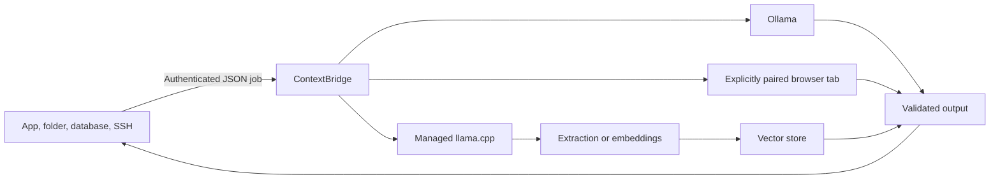

<p align="center">
  
</p>

<h1 align="center">ContextBridge</h1>

<p align="center"><strong>Move structured jobs between your apps, local models, and one browser tab you explicitly teach.</strong></p>

<p align="center">
  <a href="https://github.com/IamAngusU/ContextBridge/releases/latest"></a>
  <a href="LICENSE"></a>
  
  
  
  <a href="https://github.com/IamAngusU/ContextBridge/stargazers"></a>
</p>

ContextBridge is a local-first runtime and router for structured AI jobs. A source can be a folder, website, database worker, command pipeline, private server, or any application that can send JSON. A destination can be Ollama, a managed `llama.cpp` engine, or an AI page open in a browser tab.

The browser workflow does not require hand-written CSS selectors. Choose a tab, click **Teach this page**, then click its prompt field, send control, answer area, and optional image upload. The learned profile stays in extension storage and can be replaced at any time.


## Why ContextBridge

- **Visual browser teaching:** point at page controls instead of reverse engineering selectors.
- **Explicit scope:** only the chosen page origin and local service are requested.
- **Local models:** route text and images to Ollama without adding another hosted service.
- **Managed runtimes:** install an official `llama.cpp` release, verify its SHA256, and supervise it on localhost.
- **Hardware awareness:** inspect RAM, VRAM, CUDA, ROCm, Metal, loaded models, and CPU fallback from CLI or dashboard.
- **Extraction and embeddings:** use validated JSON extraction and native batch vector output through one protocol.
- **RAG foundation:** ingest and search tenant-isolated vectors through a replaceable vector-store interface.
- **Structured output:** model output is normalized before it reaches the calling application.
- **Fail-safe moderation:** invalid, missing, or timed-out decisions become `review`, never silent approval.
- **Flexible inputs:** HTTP, stdin, folders, SSH pipelines, database workers, and custom adapters use one protocol.
- **Inspectable operation:** a local dashboard shows routes, hardware, providers, models, latency, flags, jobs, and decisions.
- **Portable deployment:** one executable for Windows, Linux, and macOS on AMD64 and ARM64.

## Quick Start

### Windows

Open PowerShell and run:

```powershell
irm https://raw.githubusercontent.com/IamAngusU/ContextBridge/main/install.ps1 | iex
```

### Linux or macOS

```bash
curl -fsSL https://raw.githubusercontent.com/IamAngusU/ContextBridge/main/install.sh | sh
```

The installer verifies the matching published release checksum, creates a private config, sets up user autostart where supported, starts the service, and opens the local dashboard. It can use an existing Ollama installation, install a managed `llama.cpp` runtime, or pair a browser tab.

Manual installation is just as small:

```bash
contextbridge init
contextbridge serve
contextbridge dashboard
```

## Teach A Browser Tab


1. Load `extension/chromium` in Chrome, Edge, Opera, Brave, or Vivaldi. Use `extension/firefox` for Firefox.
2. Open the page you want to connect and select it in the ContextBridge extension.
3. Choose **Teach this page** and click the four requested controls directly in the page.
4. Return to the extension, test the profile, then choose **Start browser bridge**.

The Chromium package works with Manifest V3 browsers. The Firefox package has its own background manifest and localhost policy. Local Firefox development installs use `about:debugging`; a permanent consumer install requires a Mozilla-signed package.

See [Visual browser teaching](docs/browser-teaching.md) for exact browser steps and profile behavior.

## Use Ollama

Install Ollama and start ContextBridge:

```bash
contextbridge serve
```

With `model: auto`, ContextBridge selects the smallest compatible local model. Image jobs prefer a vision-capable model and embedding jobs require an embedding-capable model. An explicit model name always wins. The default route tries Ollama first and uses the paired browser only when Ollama is unavailable.

## Use Managed GGUF Models

ContextBridge can install a current official `llama.cpp` binary for the detected platform. The GitHub release digest is verified before the archive is extracted.

```bash
contextbridge runtime install llama.cpp
contextbridge pull jina-v4-retrieval
contextbridge pull nuextract3
```

Set the selected engine to `auto_start: true`. `gpu: prefer` requests full GPU offload and visibly falls back to CPU if startup fails. `gpu: require` reports an error instead. `gpu: off` stays on CPU.

The built-in manifests use [Jina v4 retrieval](https://huggingface.co/jinaai/jina-embeddings-v4-text-retrieval-GGUF) with required mean pooling and [NuExtract3](https://huggingface.co/numind/NuExtract3-GGUF) with its multimodal projector. Model downloads resume from partial files and are checked against Hugging Face LFS SHA256 metadata. Runtime calls follow the official [llama.cpp server API](https://github.com/ggml-org/llama.cpp/blob/master/tools/server/README.md) and [Ollama API](https://github.com/ollama/ollama/blob/main/docs/api.md).

## Send A Job

```bash
contextbridge submit --file examples/job.json
```

Or stream a trusted source through stdin:

```bash
ssh data-host '/opt/export-next-context-job' | contextbridge submit --file -
curl -fsS http://127.0.0.1:9000/next-job | contextbridge submit --file -
```

A folder producer can place the same JSON document in the configured inbox. ContextBridge claims it atomically and writes a neighboring `.result.json` file.

```json
{
  "source": "support-queue",
  "route": "default",
  "kind": "moderation",
  "prompt": "Review this public submission.",
  "text": "Content supplied by the user"
}
```

See the [job protocol](docs/protocol.md) and [integration recipes](docs/integrations.md).

Choose an explicit output contract per job:

| Mode | Result | Typical use |
| --- | --- | --- |
| `decision` | Strict `allow` or `review` object | Moderation and approval gates |
| `json` | Parsed JSON with optional required keys | Extraction, classification, enrichment |
| `text` | Bounded plain text | Summaries, drafts, and transformations |
| `embedding` | Native `[][]float32` with dimensions | Search, clustering, and RAG |
| `rag` | Indexed count or ranked document matches | Tenant-isolated retrieval |

ContextBridge treats every result as data. It never evaluates returned code or runs returned commands.

## Configuration

Generated config locations:

| Platform | Default path |
| --- | --- |
| Windows | `%LOCALAPPDATA%\ContextBridge\config.yml` |
| Linux | `~/.config/contextbridge/config.yml` |
| macOS | `~/.config/contextbridge/config.yml` |

Start from [config.example.yml](config.example.yml). A route declares a primary provider, ordered fallbacks, timeout, and optional browser profile. Visual profiles live in extension storage; YAML profiles remain available for audited and reproducible deployments.

```yaml
routes:
  default:
    provider: ollama
    fallback: [browser]
    timeout_seconds: 180
    browser_profile: ""
  embedding:
    provider: jina
    fallback: [ollama]
    task: embedding

engines:
  jina:
    type: llama_cpp
    model: jina-v4-retrieval
    listen: 127.0.0.1:32147
    auto_start: true
    gpu: prefer
    mode: embedding
    pooling: mean
```

Leave `browser_profile` empty for the profile taught in the extension. Set it to a YAML profile name when the server must require a reviewed selector set.

## Architecture



ContextBridge never executes commands returned by a model. Source credentials stay with the source process. Browser page content is treated as untrusted data and output is reduced to the configured decision vocabulary.

Read [Architecture](docs/architecture.md) and [Security](docs/security.md) before connecting a remote source.

## Repository Layout

| Path | Purpose |
| --- | --- |
| `cmd/contextbridge` | Cross-platform CLI and service entry point |
| `internal/bridge` | Routing, providers, local API, storage, and dashboard |
| `internal/config` | YAML parsing, defaults, and validation |
| `internal/modelregistry` | Verified GGUF model downloads and local registry |
| `internal/systeminfo` | Cross-platform hardware and backend telemetry |
| `internal/vectorstore` | Replaceable RAG storage contract and local backend |
| `extension/src` | Shared browser extension source |
| `extension/chromium` | Ready-to-load Chromium package |
| `extension/firefox` | Ready-to-load Firefox package |
| `scripts` | Reproducible extension and release checks |
| `docs` | Protocol, architecture, security, and integrations |

## Development

```bash
go test ./...
go vet ./...
./scripts/package-extensions.sh
./scripts/verify-extensions.sh
```

Contributions are welcome. Start with [CONTRIBUTING.md](CONTRIBUTING.md), use a focused issue for behavior changes, and include tests for routing or protocol work.

## Project Status

ContextBridge is usable today for local and private workflows. Browser pages can change their HTML without notice, so visual profiles are testable and automation failures return `review`. Store distribution for browser extensions is planned; current release packages are ready for local loading and Mozilla signing.

MIT licensed. Built and maintained by [Angus Uelsmann](https://github.com/IamAngusU).
