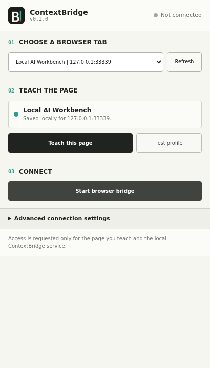

# Visual Browser Teaching

Visual teaching lets an operator define a browser workflow by clicking the controls in the real page.

## Install The Extension

### Chrome

1. Open `chrome://extensions`.
2. Enable Developer mode.
3. Choose **Load unpacked** and select `extension/chromium`.

### Edge

1. Open `edge://extensions`.
2. Enable Developer mode.
3. Choose **Load unpacked** and select `extension/chromium`.

### Opera

1. Open `opera://extensions`.
2. Enable Developer mode.
3. Choose **Load unpacked** and select `extension/chromium`.

### Firefox

1. Open `about:debugging#/runtime/this-firefox`.
2. Choose **Load Temporary Add-on**.
3. Select `extension/firefox/manifest.json`.

Firefox removes temporary add-ons when the browser closes. Permanent consumer installation requires a Mozilla-signed package. The release package already uses the Firefox-specific Manifest V3 background and content security policy needed for signing.

## Teach A Page

1. Start ContextBridge and open the target AI page.
2. Open the extension and choose the current tab. Grant optional all-tabs access only when you need another window.
3. Choose **Teach this page**.
4. Click the prompt field.
5. Click the send control, or skip when Enter submits.
6. Click one complete assistant response.
7. Click the image upload control, or skip for a text-only workflow.
8. Open the extension again and choose **Test profile**.
9. Choose **Start browser bridge**.

The page overlay intercepts teaching clicks, so it does not submit text or open the file chooser while controls are being selected.

Use a dedicated chat tab and start from a fresh conversation when jobs must not
share conversational history. ContextBridge waits for a stable answer and for
common generation-busy indicators to disappear before it returns a result, but
the page remains a stateful third-party interface. Only automate a provider when
its account terms and your organization policy allow it.

The browser path avoids a separate inference API integration; it does not move a
hosted provider's model onto the client. For actual client-side compute, use a
local Ollama or `llama.cpp` worker. For parallel web-chat jobs, pair multiple
browser workers and submit with `requirements.provider: browser`; each taught tab
is deliberately treated as one serial UI slot.

## Selector Strategy

The picker prefers stable page attributes such as IDs, `data-testid`, semantic roles, names, and accessible labels. It stores several ordered candidates for each control. Generated-looking IDs and classes are rejected. A bounded structural selector is kept as a final fallback.

The response selector may intentionally match multiple assistant messages. ContextBridge reads the newest matching response after a job is submitted.

## Permissions

The base extension has storage, active-tab, and script injection permissions. Host access is optional and requested for:

- the selected page origin
- `http://127.0.0.1` or `http://localhost` for the local service

The optional tabs permission is requested only after choosing **Show tabs from every window**.

## Retest Or Replace A Profile

Page interfaces change. Choose **Test profile** after a provider redesign. Choose **Teach this page** again to replace the local profile, or use **Forget profile for this page** under advanced settings.

YAML browser profiles remain available when a reviewed selector set must be distributed across several machines.

The advanced **Accepted server profile** setting scopes which named browser queue this extension can lease. Jobs without a named server profile remain eligible. Set the matching name when several browser workers serve different routes.
